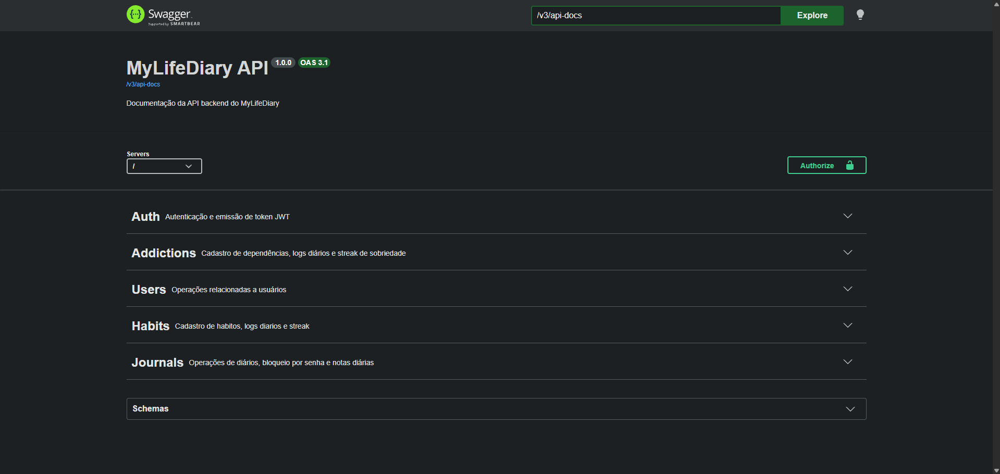
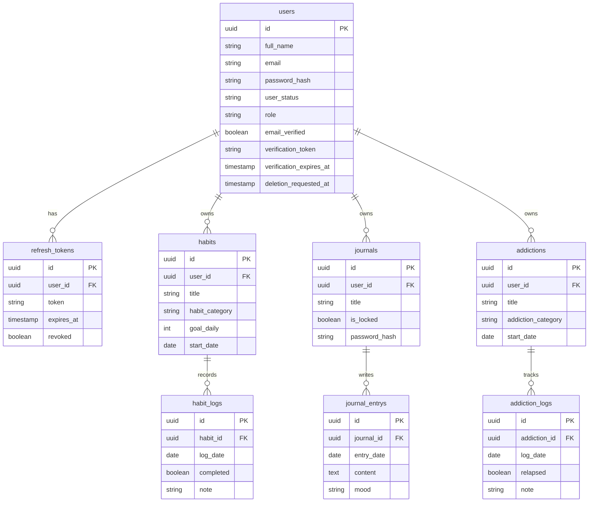

# MyLifeDiary


> "Um espaço digital para cuidar da sua mente, construir hábitos saudáveis e evoluir um dia de cada vez."

O projeto resolve um problema prático: transformar autocuidado e disciplina em fluxos rastreáveis (hábitos, diário,
recuperação de vícios e ciclo de conta). Para desenvolvedores, prioriza previsibilidade de manutenção com módulos
independentes e regras explícitas de domínio. Para avaliadores técnicos, as decisões foram orientadas por separação de
responsabilidades, tratamento consistente de erro e rastreabilidade de comportamento no banco.



### Por que esse projeto

Escolhi desenvolver o MyLifeDiary porque acredito que o autocuidado e o desenvolvimento pessoal merecem um espaço
digital acolhedor, que vá além de simples listas de tarefas. Percebi que muitas pessoas enfrentam dificuldades para
manter hábitos saudáveis, registrar seus sentimentos e lidar com desafios como solidão e vícios, mas as ferramentas
existentes costumam tratar esses aspectos de forma isolada. Meu objetivo é criar uma plataforma que reúna tudo isso em
um único ambiente, oferecendo uma experiência confortável, privada e voltada ao crescimento pessoal, tornando a
plataforma o seu espaço pessoal.

---

## Sumário

- [Tecnologias usadas](#tecnologias-usadas)
- [Decisões de arquitetura](#decisões-de-arquitetura)
- [Regras de negócio](#regras-de-negócio)
- [Modelo de dados](#modelo-de-dados)
- [Testes automatizados](#testes-automatizados)
- [Como rodar o projeto](#como-rodar-o-projeto)
- [Estrutura de pastas](#estrutura-de-pastas)
- [Próximos passos](#próximos-passos)

---

## Tecnologias usadas

### Linguagem, framework e base

| Tecnologia                               | Papel                            |
|------------------------------------------|----------------------------------|
| Java 25                                  | Linguagem principal              |
| Spring Boot 4.0.5                        | Framework da aplicação           |
| Spring Web MVC                           | Camada HTTP                      |
| Spring Data JPA                          | Persistência                     |
| Spring Security + OAuth2 Resource Server | Autenticação/autorização via JWT |
| Bean Validation                          | Validação estrutural de entrada  |
| Flyway                                   | Versionamento de schema          |
| Springdoc OpenAPI                        | Documentação de API              |

### Banco de dados e execução

- **PostgreSQL** — banco principal, usado em produção e no ambiente Docker.
- **H2** — execução e testes locais rápidos, sem dependência externa.
- **Docker + Docker Compose** — subida padronizada de aplicação e banco, evitando divergência entre ambientes.

### Bibliotecas de suporte

- **Lombok** — reduz boilerplate sem esconder regra de negócio.
- **UUID Creator** — geração de UUID estável e consistente para entidades.
- **Bucket4j** — rate limit declarativo por rota sensível (registro/login).
- **Caffeine** — cache local dos buckets, para limitar custo do rate limiting.
- **spring-dotenv** — leitura de variáveis por `.env` em desenvolvimento.
- **Resend Java** — envio transacional de e-mail para verificação de conta.
- **Bouncy Castle** — suporte criptográfico adicional no ecossistema Java.

---

## Decisões de arquitetura

**Padrão adotado:** monolito modular, com camadas internas por contexto de negócio
(`controller → service → domain → repository`), separado por módulos independentes (`user`, `auth`, `habit`, `journal`,
`addiction`).

O projeto já cobre, além de cadastro e autenticação, três domínios de negócio completos (hábitos, diário e
dependências), verificação de e-mail e rate limiting nas rotas sensíveis.

### Decisão: `Result<T>` para falhas esperadas, em vez de exceção para tudo

- **Alternativas consideradas:** exceção para qualquer erro de negócio; retorno booleano + mensagem solta.
- **Por que venceu:** mantém o fluxo explícito, testável e previsível no service/controller.
- **Trade-off aceito:** exige catálogo de códigos de erro e disciplina de mapeamento HTTP.

### Decisão: modularização por contexto de negócio + camadas internas

- **Alternativas consideradas:** pacote global por tipo técnico (todos os `service` juntos, todos os `controller`
  juntos).
- **Por que venceu:** reduz acoplamento entre domínios e melhora manutenção local — mexer em `habit` não exige entender
  `journal`.
- **Trade-off aceito:** mais arquivos e navegação inicial maior para quem chega no projeto.

### Decisão: autenticação JWT stateless com refresh token persistido

- **Alternativas consideradas:** sessão stateful em servidor; JWT sem rotação de refresh token.
- **Por que venceu:** simplifica escala horizontal e mantém revogação real no fluxo de refresh/logout.
- **Trade-off aceito:** maior complexidade de segurança e gestão de token.

### Decisão: Flyway para schema versionado

- **Alternativas consideradas:** geração automática de schema pelo ORM (`ddl-auto`).
- **Por que venceu:** histórico auditável e reprodutível de mudanças de banco.
- **Trade-off aceito:** esforço manual por migration.

### Decisão: jobs agendados para o ciclo de vida do usuário

- **Alternativas consideradas:** exclusão síncrona imediata via API.
- **Por que venceu:** preserva janela de recuperação de conta e retenção controlada.
- **Trade-off aceito:** regra temporal fica distribuída entre domínio, service e job.

---

## Regras de negócio

### Usuário e autenticação

- Cadastro exige e-mail único; senha é armazenada em hash.
- Login só é permitido com credenciais válidas, e-mail verificado e status `ACTIVE`.
- Verificação de e-mail usa token com expiração de 24h.
- Refresh token pode ser renovado e revogado (logout).
- Ciclo de vida da conta:
    - `ACTIVE → PENDING_DELETION` ao solicitar desativação.
    - `PENDING_DELETION → ACTIVE` via reativação.
    - Job diário move para `INACTIVE` após 30 dias.
    - Job diário remove definitivamente após 37 dias do pedido.

### Hábito

- Exige usuário, título, categoria e data de início.
- `goalDaily`, quando informado, deve ser maior que zero.
- Um único log por hábito por dia.
- Não permite log com data anterior ao início do hábito.
- Streak conta dias consecutivos a partir de hoje com `completed = true`.

### Diário

- Pertence a um usuário e pode ser bloqueado por senha.
- Entrada diária é única por diário/data.
- Conteúdo da entrada tem limite de 20.000 caracteres.
- Operações de escrita exigem diário desbloqueado.

### Dependência (Addiction)

- Exige usuário, título, categoria e data de início.
- Um único log por dependência por dia.
- Não permite log anterior ao início.
- Streak de sobriedade é interrompida por recaída (`relapsed = true`) ou ausência de log no dia.

### Casos de borda tratados explicitamente

- Cadastro com e-mail duplicado.
- Atualização de e-mail para o mesmo valor atual.
- Reativação de conta fora do estado permitido.
- Refresh token revogado, expirado ou inexistente.
- Intervalo de datas inválido em consultas de logs.

---

## Modelo de dados

### Entidades principais

- **users** — dados de conta, status, role e metadados de verificação de e-mail.
- **refresh_tokens** — tokens de renovação vinculados ao usuário.
- **habits / habit_logs** — definição do hábito e execução diária.
- **journals / journal_entrys** — diário e entradas por data.
- **addictions / addiction_logs** — dependência e registros de recaída/sobriedade.

### Relacionamentos-chave

- `users` 1:N `habits`
- `users` 1:N `journals`
- `users` 1:N `addictions`
- `users` 1:N `refresh_tokens`
- `habits` 1:N `habit_logs`
- `journals` 1:N `journal_entrys`
- `addictions` 1:N `addiction_logs`

### Diagrama ER



### Decisões de modelagem não triviais

- **Unicidade por dia em logs** (`habit_id + date`, `journal_id + date`, `addiction_id + date`) para impedir duplicidade
  silenciosa de registros diários.
- **Status explícito de usuário** em vez de soft delete genérico, para suportar o fluxo temporal de
  desativação/reativação.
- **Refresh token persistido e revogável**, permitindo logout efetivo e rotação real de token.
- **Índices por chave de busca funcional** (e-mail, status, datas e FKs) para consultas frequentes e jobs agendados.

---

## Testes automatizados

### Estratégia

- Meta interna de cobertura: **80%**, usada como referência de qualidade durante o desenvolvimento (ainda sem badge/CI
  público de verificação automática).
- Predominância de testes unitários em domínio e serviços.
- Testes de integração focados nos contratos HTTP essenciais.
- Testes específicos para segurança (JWT) e rate limiting.

### Ferramentas

- JUnit 5
- Mockito
- Spring Test / Spring Boot Test

### Organização dos testes unitários

- Estrutura espelhada por módulo (`src/test/java/.../modules/...`).
- Mocks aplicados às dependências externas (repositórios, encoder, serviços externos).
- Uso de `Clock` controlado para cenários temporais (expiração de token, streak, jobs).
- Nomes de teste descritivos por comportamento e caso de borda.

### Exemplos de casos de borda cobertos

- `refresh_tokenExpired_returnsFailure`
- `getCurrentSobrietyStreakShouldReturnZeroWhenTodayHasNoLog`
- `changeEmail_sameEmail`
- `isExpiredShouldReturnTrueWhenExactlyAtExpiration`

### Por que essa estratégia

Ela protege regras críticas de domínio (estado, datas, autorização e token), reduz regressão em fluxos sensíveis e
mantém feedback rápido para manutenção do dia a dia.

---

## Como rodar o projeto

### Pré-requisitos

- Java 25
- Docker e Docker Compose (opcional, recomendado)

### Variáveis de ambiente

Copie `env.example` para `.env` e ajuste os valores. Principais variáveis:

| Variável                              | Descrição                              |
|---------------------------------------|----------------------------------------|
| `JWT_SECRET`                          | Chave de assinatura do token JWT       |
| `JWT_EXPIRATION`                      | Tempo de expiração do access token     |
| `JWT_REFRESH_TOKEN_EXPIRATION_DAYS`   | Validade do refresh token em dias      |
| `DB_NAME`, `DB_USER`, `DB_PASSWORD`   | Credenciais do PostgreSQL              |
| `RESEND_API_KEY`, `RESEND_FROM_EMAIL` | Envio de e-mail transacional           |
| `APP_BASE_URL`                        | URL base usada em links de verificação |

### Execução local (sem Docker)

```bash
./mvnw spring-boot:run
```

### Execução de testes

```bash
./mvnw test
```

### Execução com Docker

```bash
cp env.example .env
docker compose up --build -d
```

Serviços disponíveis:

- API: `http://localhost:8080`
- Documentação interativa da API (Swagger UI), disponível após subir a aplicação localmente:
  `http://localhost:8080/swagger-ui/index.html`
- PostgreSQL: `localhost:5433`

Para parar:

```bash
docker compose down
```

---

## Estrutura de pastas

```text
src/main/java/com/diegoramos/mylifediary
├── common/       # Base compartilhada (Result, erros, helpers, utilitários)
├── config/       # Segurança JWT, Swagger/OpenAPI, configuração de tempo
└── modules/
    ├── auth/         # Login, refresh, logout e persistência de refresh token
    ├── user/         # Cadastro, perfil, verificação de e-mail e lifecycle da conta
    ├── habit/        # Definição de hábitos, logs diários e streak
    ├── journal/       # Diário, bloqueio por senha e entradas por data
    └── addiction/     # Dependências, recaídas e streak de sobriedade

src/main/resources
└── db/migration/  # Migrations Flyway (schema e evolução de colunas)

src/test/java      # Testes unitários e de integração por módulo

k6/                # Scripts de carga (cadastro e fluxo autenticado)

docs/              # Documentação interna de arquitetura, fluxos e decisões
```

---

## Próximos passos

- Fechar o controle de autorização por proprietário de recurso (não apenas autenticação), evitando acesso por `userId`
  de terceiros em endpoints de módulo.
- Consolidar e versionar ADRs formais para decisões de segurança e modelagem (refresh rotation, lifecycle e políticas de
  log).
- Expandir cobertura de integração para fluxos completos multi-módulo (ex.: cadastro → verificação → login → uso
  protegido) até consolidar a meta de 80% com relatório contínuo.

---

## Contato

**Diego Ramos dos Santos** |
[LinkedIn](https://www.linkedin.com/in/diego-ramos-702a8922a/) · [GitHub](https://github.com/DiegoRamos1012)