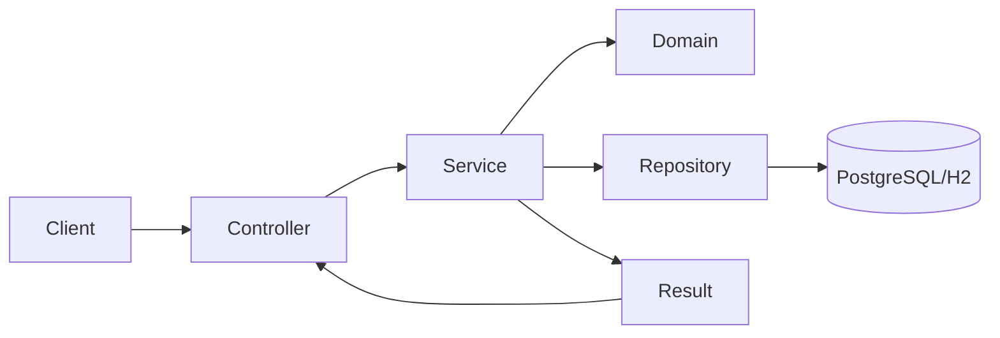

# MyLifeDiary

   

**Um espaço digital para cuidar da sua mente, construir hábitos saudáveis e evoluir um dia de cada vez.**

O projeto resolve um problema prático: transformar autocuidado e disciplina em fluxos rastreáveis (hábitos, diário, recuperação de vícios e ciclo de conta). Para desenvolvedores, ele prioriza previsibilidade de manutenção com módulos independentes e regras explícitas de domínio. Para avaliadores técnicos, as decisões foram orientadas por separação de responsabilidades, tratamento consistente de erro e rastreabilidade de comportamento no banco.

---

## 1) Tecnologias usadas

### Linguagem, framework e base
- **Java 25**
- **Spring Boot 4.0.5**
- **Spring Web MVC** (camada HTTP)
- **Spring Data JPA** (persistência)
- **Spring Security + OAuth2 Resource Server (JWT)**
- **Bean Validation** (validação estrutural de entrada)
- **Flyway** (versionamento de schema)
- **Springdoc OpenAPI** (documentação de API)

### Banco de dados e execução
- **PostgreSQL** (ambiente principal)
- **H2 + spring-boot-h2console** (execução/testes locais rápidos)
- **Docker + Docker Compose** (subida padronizada de app + banco)

### Bibliotecas de suporte relevantes
- **Lombok** → reduz boilerplate sem esconder regra de negócio.
- **UUID Creator** → geração de UUID estável e consistente para entidades.
- **Bucket4j** → rate limit declarativo por rota sensível (registro/login).
- **Caffeine** → cache local dos buckets para limitar custo de rate limiting.
- **spring-dotenv** → leitura simples de variáveis por `.env` em desenvolvimento.
- **Resend Java** → integração transacional de e-mail para verificação de conta.
- **Bouncy Castle** → suporte criptográfico adicional no ecossistema Java.

---

## 2) Decisões de arquitetura

### Padrão arquitetural adotado
Monolito modular com camadas internas por contexto de negócio (`controller -> service -> domain -> repository`).



### Decisões (formato solicitado)

**Decisão:** usar `Result<T>` para falhas esperadas (em vez de exceção para tudo)  
**Alternativas consideradas:** exceções para qualquer erro de negócio; retorno booleano + mensagem solta  
**Por que venceu:** mantém fluxo explícito, testável e previsível no service/controller  
**Trade-off aceito:** exige catálogo de códigos de erro e disciplina de mapeamento HTTP

**Decisão:** modularização por contexto (`user`, `auth`, `habit`, `journal`, `addiction`) + camadas internas  
**Alternativas consideradas:** pacote global por tipo (`service`, `controller`, etc.)  
**Por que venceu:** reduz acoplamento entre domínios e melhora manutenção local  
**Trade-off aceito:** mais arquivos e navegação inicial maior para quem chega no projeto

**Decisão:** autenticação JWT stateless com refresh token persistido  
**Alternativas consideradas:** sessão stateful em servidor; JWT sem rotação de refresh  
**Por que venceu:** simplifica escala horizontal e mantém revogação no fluxo de refresh/logout  
**Trade-off aceito:** maior complexidade de segurança e gestão de token

**Decisão:** Flyway para schema versionado  
**Alternativas consideradas:** geração automática de schema pelo ORM  
**Por que venceu:** histórico auditável e reprodutível de mudanças de banco  
**Trade-off aceito:** esforço manual por migration

**Decisão:** jobs agendados para lifecycle de usuário  
**Alternativas consideradas:** exclusão síncrona imediata na API  
**Por que venceu:** preserva janela de recuperação de conta e retenção controlada  
**Trade-off aceito:** regra temporal distribuída entre domínio, service e job

**Nota de consistência entre fontes:** parte da documentação em `/docs` descreve estados históricos do projeto (ex.: foco inicial só em `user/auth` e planos futuros), enquanto o código atual já possui `habit`, `journal`, `addiction`, verificação de e-mail e rate limiting; este README reflete o estado real implementado.

---

## 3) Regras de negócio

### Usuário e autenticação
- Cadastro exige e-mail único; senha é armazenada em hash.
- Login só é permitido com **credenciais válidas**, **e-mail verificado** e **status ACTIVE**.
- Verificação de e-mail usa token com expiração (24h no fluxo de registro).
- Refresh token pode ser renovado e revogado (logout).
- Regras de ciclo de vida:
  - `ACTIVE -> PENDING_DELETION` ao solicitar desativação.
  - `PENDING_DELETION -> ACTIVE` via reativação.
  - Job diário move para `INACTIVE` após 30 dias.
  - Job diário remove definitivamente após 37 dias do pedido.

### Hábito
- Hábito exige usuário, título, categoria e data de início.
- `goalDaily` (quando informado) deve ser maior que zero.
- Um único log por hábito por dia.
- Não permite log com data anterior ao início do hábito.
- Streak conta dias consecutivos a partir de hoje com `completed=true`.

### Diário
- Diário pertence a um usuário e pode ser bloqueado por senha.
- Entrada diária é única por diário/data.
- Conteúdo da entrada tem limite de 20.000 caracteres.
- Operações de escrita exigem diário desbloqueado.

### Dependência (Addiction)
- Dependência exige usuário, título, categoria e data de início.
- Um único log por dependência por dia.
- Não permite log anterior ao início.
- Streak de sobriedade é interrompida por recaída (`relapsed=true`) **ou** ausência de log no dia.

### Casos de borda tratados explicitamente
- Cadastro com e-mail duplicado.
- Atualização de e-mail para o mesmo valor atual.
- Reativação de conta fora do estado permitido.
- Refresh token revogado/expirado/inexistente.
- Intervalo de datas inválido em consultas de logs.

---

## 4) Modelo de dados

### Entidades principais e relacionamentos
- **users**: dados de conta, status, role e metadados de verificação de e-mail.
- **refresh_tokens**: tokens de renovação vinculados ao usuário.
- **habits** / **habit_logs**: definição do hábito e execução diária.
- **journals** / **journal_entrys**: diário e entradas por data.
- **addictions** / **addiction_logs**: dependência e registros de recaída/sobriedade.

Relacionamentos-chave:
- `users 1:N habits`
- `users 1:N journals`
- `users 1:N addictions`
- `users 1:N refresh_tokens`
- `habits 1:N habit_logs`
- `journals 1:N journal_entrys`
- `addictions 1:N addiction_logs`

### ER (Mermaid)

```mermaid
erDiagram
    users ||--o{ refresh_tokens : has
    users ||--o{ habits : owns
    users ||--o{ journals : owns
    users ||--o{ addictions : owns

    habits ||--o{ habit_logs : records
    journals ||--o{ journal_entrys : writes
    addictions ||--o{ addiction_logs : tracks

    users {
      uuid id PK
      string full_name
      string email UNIQUE
      string password_hash
      string user_status
      string role
      boolean email_verified
      string verification_token
      timestamp verification_token_expires_at
      timestamp deletion_requested_at
    }

    refresh_tokens {
      uuid id PK
      uuid user_id FK
      string token UNIQUE
      timestamp expires_at
      boolean revoked
    }

    habits {
      uuid id PK
      uuid user_id FK
      string title
      string habit_category
      int goal_daily
      date start_date
    }

    habit_logs {
      uuid id PK
      uuid habit_id FK
      date date
      boolean completed
      string note
    }

    journals {
      uuid id PK
      uuid user_id FK
      string title
      boolean is_locked
      string password_hash
    }

    journal_entrys {
      uuid id PK
      uuid journal_id FK
      date date
      text content
      string mood
    }

    addictions {
      uuid id PK
      uuid user_id FK
      string title
      string addiction_category
      date start_date
    }

    addiction_logs {
      uuid id PK
      uuid addiction_id FK
      date date
      boolean relapsed
      string note
    }
```

### Decisões de modelagem não triviais
- **Unicidade por dia** em logs (`(habit_id,date)`, `(journal_id,date)`, `(addiction_id,date)`) para impedir duplicidade silenciosa.
- **Status explícito de usuário** em vez de soft delete genérico para suportar fluxo temporal de desativação/reativação.
- **Refresh token persistido e revogável** para logout efetivo e rotação.
- **Índices por chave de busca funcional** (e-mail, status, datas e FKs) para consultas frequentes e jobs.

---

## 5) Testes automatizados

### Estratégia
- Meta de cobertura: **80%**.
- Predominância de testes unitários em domínio e serviços.
- Testes de integração focados em contratos HTTP essenciais.
- Testes específicos de segurança (JWT e rate limiting).

### Ferramentas
- JUnit 5
- Mockito
- Spring Test / Spring Boot Test

### Organização dos testes unitários
- Estrutura espelhada por módulo (`src/test/java/.../modules/...`).
- Mocks em dependências externas (repositórios, encoder, serviços externos).
- Uso de `Clock` controlado para cenários temporais (expiração/token/streak/jobs).
- Nomes de teste descritivos por comportamento e borda.

### Exemplos de casos de borda cobertos
- `refresh_tokenExpired_returnsFailure`
- `getCurrentSobrietyStreakShouldReturnZeroWhenTodayHasNoLog`
- `changeEmail_sameEmail`
- `isExpiredShouldReturnTrueWhenExactlyAtExpiration`

### Por que essa estratégia
Ela protege regras críticas de domínio (estado, datas, autorização e token), reduz regressão em fluxos sensíveis e mantém feedback rápido para manutenção cotidiana.

---

## 6) Como rodar o projeto

### Pré-requisitos
- Java 25
- Docker e Docker Compose (opcional, recomendado)

### Variáveis de ambiente
Baseie-se em `env.example` e crie um `.env` na raiz.

Principais variáveis:
- `JWT_SECRET`
- `JWT_EXPIRATION`
- `JWT_REFRESH_TOKEN_EXPIRATION_DAYS`
- `DB_NAME`, `DB_USER`, `DB_PASSWORD`
- `RESEND_API_KEY`, `RESEND_FROM_EMAIL`
- `APP_BASE_URL`

### Execução local (sem Docker)
```bash
./mvnw spring-boot:run
```

### Execução de testes
```bash
./mvnw test
```

### Execução com Docker
```bash
cp env.example .env
docker compose up --build -d
```

Serviços:
- API: `http://localhost:8080`
- PostgreSQL: `localhost:5433`

Parar:
```bash
docker compose down
```

---

## 7) Estrutura de pastas

```text
src/main/java/com/diegoramos/mylifediary
├── common/                      # Base compartilhada (Result, erros, helpers, utilitários)
├── config/                      # Segurança JWT, Swagger/OpenAPI, configuração de tempo
└── modules/
    ├── auth/                    # Login, refresh, logout e persistência de refresh token
    ├── user/                    # Cadastro, perfil, verificação de e-mail e lifecycle da conta
    ├── habit/                   # Definição de hábitos, logs diários e streak
    ├── journal/                 # Diário, bloqueio por senha e entradas por data
    └── addiction/               # Dependências, recaídas e streak de sobriedade

src/main/resources
└── db/migration/                # Migrations Flyway (schema e evolução de colunas)

src/test/java                    # Testes unitários e integração por módulo

k6/                              # Scripts de carga (cadastro e fluxo autenticado)

docs/                            # Documentação interna de arquitetura, fluxos e decisões
```

---

## 8) Próximos passos

1. Fechar o controle de autorização por proprietário de recurso (não apenas autenticação), evitando acesso por `userId` de terceiros em endpoints de módulo.
2. Consolidar e versionar ADRs formais para decisões de segurança e modelagem (refresh rotation, lifecycle e políticas de log).
3. Expandir cobertura de integração para fluxos completos multi-módulo (ex.: cadastro -> verificação -> login -> uso protegido) até consolidar a meta de 80% com relatório contínuo.
